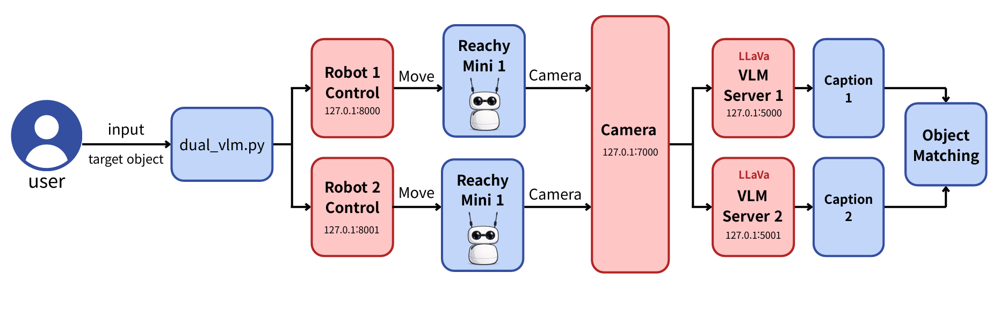

# Dual Reachy Mini VLM Search System

A dual-robot vision-language search system using two Reachy Mini robots and two Vision-Language Model (VLM) servers.

The robots collaboratively explore the environment and detect a target object using multimodal perception.

---

# System Architecture



---

# Requirements

## Hardware

- Two Reachy Mini robots
- Two cameras (Reachy cameras)
- GPU capable of running VLM models (RTX 4090 / RTX 5090 recommended)

## Software

- Python 3.10
- PyTorch Nightly (CUDA 12.8)
- Transformers
- Flask
- OpenCV

---

# System Components

The system consists of multiple services.

| Component | Description | Port |
|-----------|-------------|------|
| Reachy Mini 1 | Robot control API | 8000 |
| Reachy Mini 2 | Robot control API | 8001 |
| VLM Server 1 | Vision-language inference | 5000 |
| VLM Server 2 | Vision-language inference | 5001 |
| Detection Server | Camera + VLM interface | 7000 |
| Search Controller | Dual robot search logic | - |

---

# Virtual Environments

Two virtual environments are used.

| Environment | Purpose |
|-------------|---------|
| vlm_env | VLM inference servers |
| reachy_env | Robot control and system services |

---

# Installation

## Create Virtual Environments and Install Dependencies

```powershell
# Clone repository
git clone https://github.com/YOUR_REPO/reachy_mini_vlm.git
cd reachy_mini_vlm

# Create virtual environments
python -m venv vlm_env
python -m venv reachy_env

# Activate VLM environment
vlm_env\Scripts\activate

# Remove existing torch
pip uninstall torch torchvision torchaudio -y

# Install PyTorch nightly (RTX 5090)
pip install --pre torch torchvision torchaudio --index-url https://download.pytorch.org/whl/nightly/cu128

# Install dependencies
pip install transformers accelerate flask pillow opencv-python requests pynput

# Deactivate environment
deactivate
```
---

# Run System

Open multiple terminals and run the following commands.

```powershell
# Terminal 1 — Reachy Mini 1
cd reachy_mini_vlm
reachy_env\Scripts\activate
reachy-mini-daemon --serialport COM3 --robot-name reachy1 --fastapi-port 8000

# Terminal 2 — Reachy Mini 2
cd reachy_mini_vlm
reachy_env\Scripts\activate
reachy-mini-daemon --serialport COM4 --robot-name reachy2 --fastapi-port 8001

# Terminal 3 — VLM Server 1
cd reachy_mini_vlm
vlm_env\Scripts\activate
python vlm_server1.py

# Terminal 4 — VLM Server 2
cd reachy_mini_vlm
vlm_env\Scripts\activate
python vlm_server2.py

# Terminal 5 — Detection Server
cd reachy_mini_vlm
reachy_env\Scripts\activate
python dual_reachy_server.py

# Terminal 6 — Dual Robot Search
cd reachy_mini_vlm
reachy_env\Scripts\activate
python dual_reachy_vlm_search.py
```
